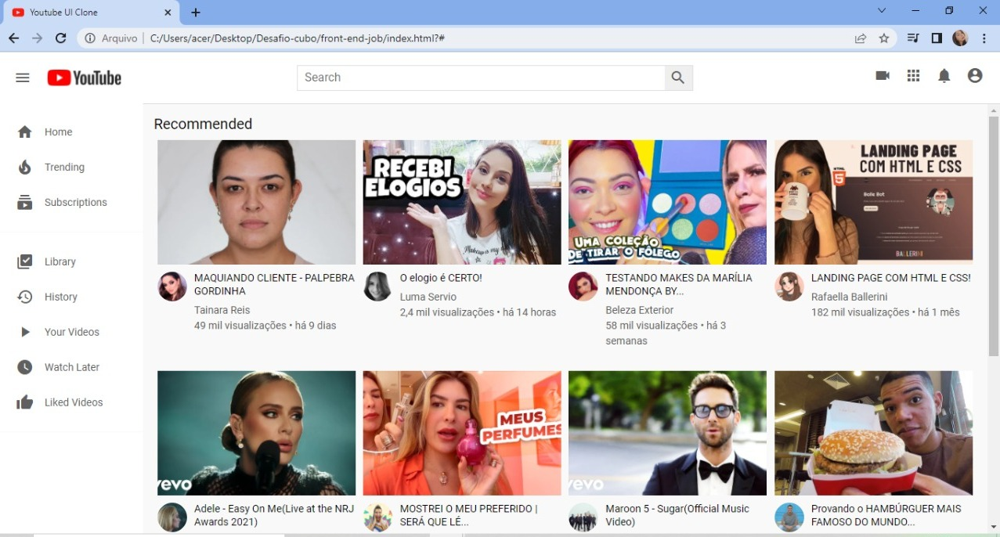

<h1>Youtube UI Clone</h1>

<h2>Sobre o projeto</h2> 

O projeto desenvolvido é uma "cópia" do Youtube original

<h3>Tecnologias utilizadas:</h3>
° HTML 
° CSS 
° Javascript 
° bootstrap 

<h3>Demonstração:</h3> 
  

Para rodar a aplicação é preciso baixar todos os arquivos desse projeto e abrir o arquivo index.html

OBS.: Os arquivos estão organizados por pastas.

